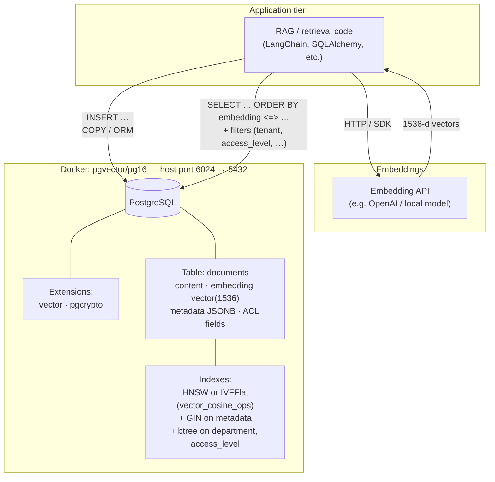

## System architecture (pgvector)

The diagram below is the logical layout for this setup: your app talks to an embedding model for 1536-dimensional vectors, stores and filters rows in PostgreSQL with the **vector** extension, and runs approximate nearest-neighbor search via **HNSW** or **IVFFlat** on the `embedding` column (plus btree/GIN on metadata and access fields).



**Ingest path:** chunks → embedding API → `documents.embedding` (+ metadata). **Query path:** question → same embedding model → SQL similarity search on `embedding` with optional predicates on `department`, `access_level`, `tenant_id`, etc.

```bash
docker ps

docker stop <container_name>

docker rm <container_name>

docker run --name pgvector-container \
  -e POSTGRES_USER=langchain \
  -e POSTGRES_PASSWORD=langchain \
  -e POSTGRES_DB=langchain \
  -p 6024:5432 \
  -d pgvector/pgvector:pg16


  # connect to postgres inside the container

  docker exec -it pgvector-container psql -U langchain -d langchain

CREATE EXTENSION IF NOT EXISTS vector;
CREATE EXTENSION IF NOT EXISTS pgcrypto; # to generate the UUID

-- List extensions
\dx

DROP TABLE IF EXISTS documents;

CREATE TABLE documents (
    id UUID PRIMARY KEY DEFAULT gen_random_uuid(),

    content TEXT NOT NULL,
    embedding vector(1536) NOT NULL,

    source_file TEXT,
    page_number INTEGER,
    chunk_index INTEGER,
    total_chunks INTEGER,
    section_header TEXT,
    doc_hash TEXT,

    department TEXT,
    access_level TEXT CHECK (access_level IN ('public', 'internal', 'confidential', 'secret')),
    tenant_id UUID,
    created_by TEXT,

    doc_type TEXT CHECK (doc_type IN ('pdf', 'docx', 'html', 'code', 'email', 'text')),
    chunk_type TEXT CHECK (chunk_type IN ('text', 'table', 'code', 'header')),
    extraction_method TEXT,
    extraction_confidence FLOAT CHECK (extraction_confidence BETWEEN 0 AND 1),
    chunk_length INTEGER,

    created_at TIMESTAMP DEFAULT NOW(),
    updated_at TIMESTAMP DEFAULT NOW(),

    metadata JSONB
);

CREATE INDEX IF NOT EXISTS documents_metadata_gin ON documents USING gin (metadata);
CREATE INDEX IF NOT EXISTS documents_department_idx ON documents (department);
CREATE INDEX IF NOT EXISTS documents_access_level_idx ON documents (access_level);

-- columns + types
SELECT
  column_name,
  data_type,
  udt_name,
  is_nullable
FROM information_schema.columns
WHERE table_name = 'documents'
ORDER BY ordinal_position;

# Load the indexes

\pset pager off

SELECT COUNT(*) FROM documents;

SELECT id, embedding
FROM documents
LIMIT 5;

SELECT id, left(content, 120) AS doc_preview, department, total_chunks, access_level
FROM documents
LIMIT 5;

#Understand size of vectors
SELECT vector_dims(embedding)
FROM documents
LIMIT 5;


CREATE INDEX documents_hnsw_idx
ON documents
USING hnsw (embedding vector_cosine_ops)
WITH (m = 16, ef_construction = 64);

\di -- check indexing


CREATE INDEX IF NOT EXISTS documents_ivfflat_idx
ON documents
USING ivfflat (embedding vector_cosine_ops)
WITH (lists = 25);

# per department count

SELECT department, COUNT(*)
FROM documents
GROUP BY department
ORDER BY COUNT(*) DESC;


\d langchain_pg_embedding;

SELECT COUNT(*) FROM langchain_pg_embedding;

SELECT id, embedding
FROM langchain_pg_embedding
LIMIT 5;

SELECT id, left(content, 120) AS doc_preview, department, total_chunks, access_level
FROM documents
LIMIT 5;

#Understand size of vectors
SELECT vector_dims(embedding)
FROM documents
LIMIT 5;